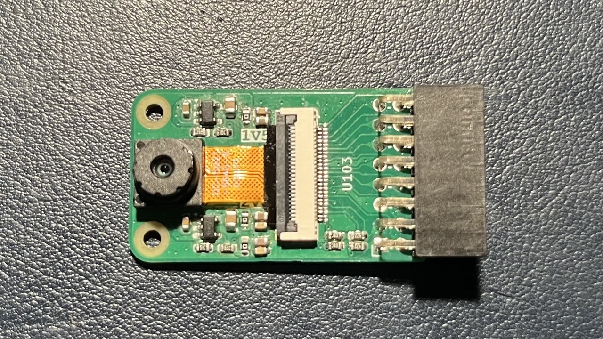
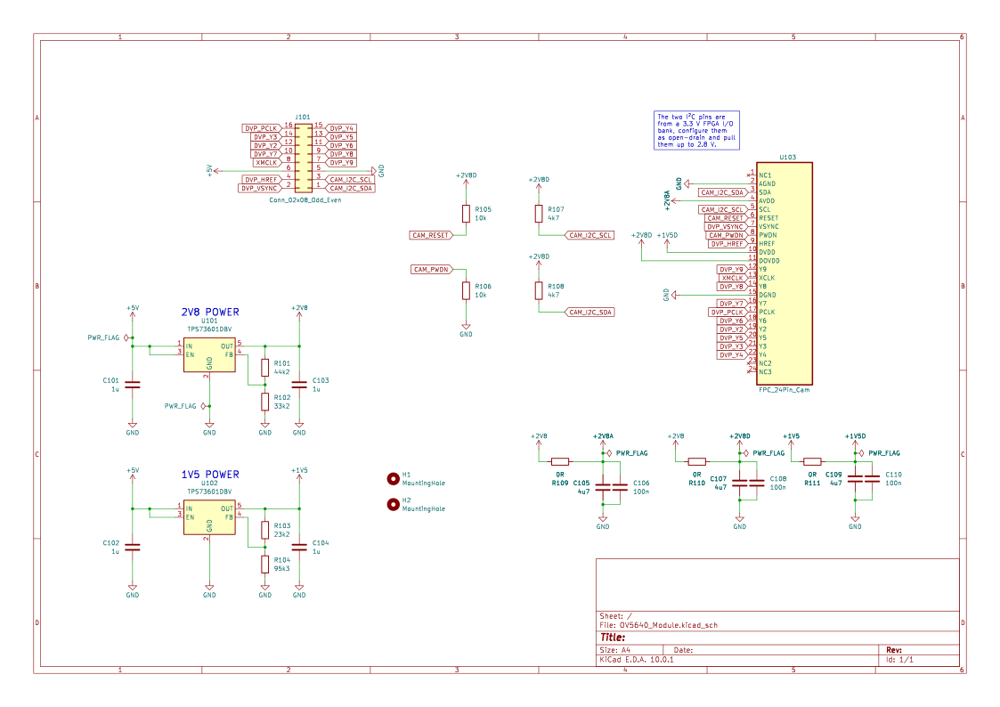

# OV5640 DVP Camera Module

This is a custom OV5640 camera adapter module designed for FPGA/MCU-based image acquisition projects.  
The board converts the OV5640 FPC interface to a standard pin header and provides the required local power rails for the camera sensor.

---

## Board Photos

### Assembled Board


### Schematic Preview



## Features

- Supports OV5640 camera module with DVP parallel output
- 8-bit DVP data bus: `DVP_Y2` ~ `DVP_Y9`
- Pixel clock, frame sync and line sync signals:
  - `DVP_PCLK`
  - `DVP_VSYNC`
  - `DVP_HREF`
- External master clock input:
  - `XCLK`
- I2C/SCCB configuration interface:
  - `CAM_I2C_SCL`
  - `CAM_I2C_SDA`
- Camera control pins:
  - `CAM_RESET`
  - `CAM_PWDN`
- On-board power regulation:
  - 2.8V rail for analog/digital IO
  - 1.5V rail for camera core power
- Local decoupling capacitors for camera power pins
- 24-pin FPC connector for OV5640 camera module
- 2x8 pin header for connection to FPGA/MCU development boards

---

## Hardware Overview

The board mainly contains the following parts:

1. **OV5640 FPC Connector**

   The camera is connected through a 24-pin FPC connector.  
   The module exposes the OV5640 DVP data bus, clock, sync signals, I2C configuration bus, reset pin and power-down pin.

2. **2x8 External Pin Header**

   A 2x8 pin header is used to connect the camera module to an external controller, such as an FPGA, ZYNQ board, STM32 board, or other custom hardware.

3. **Power Regulation**

   The board takes a 5V input and generates the required lower voltage rails locally.

   - `+2V8`: used for OV5640 analog power, digital IO power and related pull-ups
   - `+1V5`: used for OV5640 core power

4. **I2C Pull-up Resistors**

   The I2C/SCCB bus is pulled up to 2.8V through 4.7k resistors.

   > If the controller uses 3.3V IO, configure the I2C pins as open-drain and do not enable internal pull-ups to 3.3V.

5. **RESET and PWDN Default States**

   - `CAM_RESET` has a pull-up resistor
   - `CAM_PWDN` has a pull-down resistor

   These default states allow the camera to start in a normal working state after power-up.

---

## Pinout

### External 2x8 Header

| Pin | Signal |
| --- | ------ |
| 1  | `DVP_PCLK` |
| 2  | `DVP_Y4` |
| 3  | `DVP_Y3` |
| 4  | `DVP_Y5` |
| 5  | `DVP_Y2` |
| 6  | `DVP_Y6` |
| 7  | `DVP_Y7` |
| 8  | `DVP_Y8` |
| 9  | `XCLK` |
| 10 | `DVP_Y9` |
| 11 | `DVP_HREF` |
| 12 | `CAM_I2C_SCL` |
| 13 | `DVP_VSYNC` |
| 14 | `CAM_I2C_SDA` |
| 15 | `GND` |
| 16 | `GND` |

> Please verify the final pin order with the schematic before manufacturing or connecting to another board.

---

## Signal Description

| Signal | Direction | Description |
| ------ | --------- | ----------- |
| `XCLK` | Input | External clock input for OV5640. Usually provided by FPGA/MCU. Common values are 24 MHz or similar, depending on OV5640 configuration. |
| `DVP_PCLK` | Output | Pixel clock generated by OV5640. Image data should be sampled according to this clock. |
| `DVP_VSYNC` | Output | Frame synchronization signal. Indicates frame boundary. |
| `DVP_HREF` | Output | Line valid signal. Indicates valid pixel data in each row. |
| `DVP_Y2` ~ `DVP_Y9` | Output | 8-bit parallel image data bus. |
| `CAM_I2C_SCL` | Bidirectional/Open-drain | SCCB/I2C clock line for camera register configuration. |
| `CAM_I2C_SDA` | Bidirectional/Open-drain | SCCB/I2C data line for camera register configuration. |
| `CAM_RESET` | Input | Camera reset control signal. |
| `CAM_PWDN` | Input | Camera power-down control signal. |

---

## Power Supply

The board is powered from a 5V input.  
On-board LDO regulators generate the camera power rails.

| Rail | Usage |
| ---- | ----- |
| `+5V` | Input power supply |
| `+2V8` | OV5640 analog power, digital IO power and I2C pull-up voltage |
| `+1V5` | OV5640 core power |
| `GND` | Common ground |

Make sure the external controller and this module share the same ground.

---

## I2C/SCCB Notes

OV5640 uses an SCCB interface, which is very similar to I2C and can usually be controlled using a standard I2C peripheral.

Important notes:

- The pull-up voltage on this board is 2.8V.
- For 3.3V FPGA or MCU IO, use open-drain mode.
- Do not enable strong internal pull-ups to 3.3V on the controller side.
- The OV5640 register configuration must be completed before valid image data can be captured.

---

## Typical Usage

1. Connect the module to an FPGA/MCU board.
2. Provide 5V power to the module.
3. Generate `XCLK` for the OV5640.
4. Release `RESET` and keep `PWDN` inactive.
5. Configure OV5640 registers through I2C/SCCB.
6. Capture image data using:
   - `DVP_PCLK`
   - `DVP_VSYNC`
   - `DVP_HREF`
   - `DVP_Y2` ~ `DVP_Y9`

---

## Example Applications

This module can be used for:

- FPGA image acquisition
- ZYNQ camera input experiments
- STM32 DCMI camera projects
- ESP32 camera experiments
- Machine vision demos
- Real-time video processing
- Embedded image recognition
- Digital image processing course projects

---

## Repository Structure

```text
.
├── hardware/
│   ├── schematic/
│   ├── pcb/
│   └── gerber/
├── images/
│   ├── schematic.png
│   └── board_render.png
├── README.md
└── LICENSE